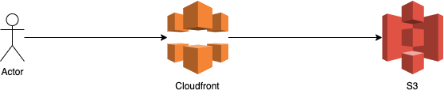

# TheBookClub - Infrastructure

This repo will provide additional infrastructure for the book club.
For example the hosting of static html files.

## Installation

1. Install the Aws Cdk CLI. Refer to the official [documentation](https://docs.aws.amazon.com/cdk/v2/guide/cli.html) or use [brew](https://formulae.brew.sh/formula/aws-cdk).
2. Install requirements
>```
>pip install -r requirements.txt 
>```
3. Locally [initialize](https://docs.aws.amazon.com/cli/latest/userguide/cli-configure-files.html) your credentials
4. Execute the bootstrap command
>```
>cdk bootstrap
>```

## Deployment
Deploy the stack with cdk
>```
>cdk deploy
>```

## Hosting
For hosting we use cloudfront and a s3 bucket to store the data.



## Contributing
Pull requests are welcome. For major changes, please open an issue first to discuss what you would like to change.

Please make sure to update tests as appropriate.

## License
[MIT](https://choosealicense.com/licenses/mit/)